# Visual Category Theory in sw-MLPL

Executable lessons where category-theory laws become diagrams you can inspect:
values move along arrows, both sides of an equation run over the same finite
inputs, and failed laws show a concrete counterexample.

The project is deliberately an sw-MLPL forcing function, not a proposal for a
category-theory DSL. It starts with functions, identity, and composition;
builds toward commutative diagrams, products, coproducts, array functors, and
natural transformations; then applies the same law-first method to contexts,
folds/unfolds, optics, and one concrete adjunction.

All nineteen lessons are implemented and checked. Start with the
[viewing guide](docs/viewing-guide.md) for the recommended paths through them.

## Run it

```sh
just check   # probes, all CLI demos, tests, documentation and generated files
just demos   # terminal lessons and SVG output under out/
just web     # rebuild standalone browser lessons under web/
just assets  # rebuild the README previews
```

## Visual progression

The foundational curriculum makes these relationships visible:

```text
value ──f──▶ value                 one morphism

A ──f──▶ B                         two paths, one result
│         │
g         h
▼         ▼
C ──k──▶ D

scalar arrow                       lifted array arrow
A ──f──▶ B                         [A] ──map(f)──▶ [B]
```

The authoritative curriculum and delivery sequence are in
[`docs/plan.md`](docs/plan.md). Potential language capabilities—including the
different meanings of “full functor support”—are tracked in
[`docs/sw-mlpl-capabilities.md`](docs/sw-mlpl-capabilities.md).

## Demo visuals

### 1. An arrow is an executable function

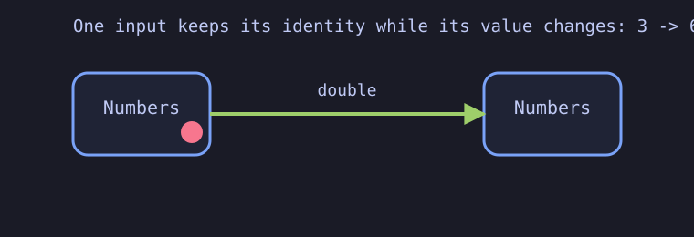

What to notice: the colored token retains its identity while its value changes
from `3` to `6`. The diagram is backed by the displayed mapping of every input,
not a single cherry-picked value. Sources: [CLI lesson](demos/01-arrows/arrows.mlpl),
[web lesson](demos/web/arrows.mlpl).

### 2. Identity changes no destination

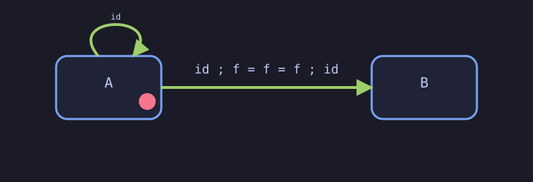

What to notice: the loop can be traversed before or after the meaningful arrow
without changing the endpoint. The three displayed arrays verify `id ; f = f =
f ; id`. Sources: [CLI lesson](demos/02-composition/identity.mlpl),
[web lesson](demos/web/identity_composition.mlpl).

### 3. Composition is associative

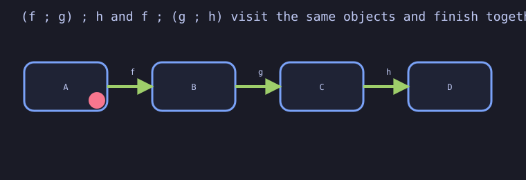

What to notice: both bracketings visit `A → B → C → D` in the same order and
finish together. Parentheses group the composition; they do not reroute it.
Sources: [CLI lesson](demos/03-associativity/bracketing.mlpl),
[web lesson](demos/web/composition_associativity.mlpl).

### 4. A commutative square is an equality you can run

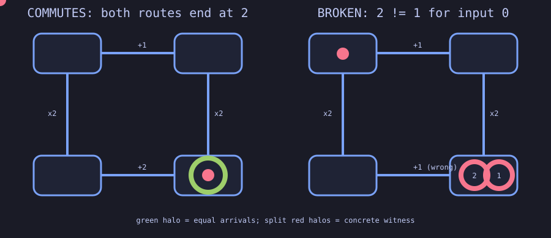

What to notice: the lawful square sends input `0` to `2` along both routes.
Changing only the bottom arrow from `+2` to `+1` makes the first input land at
`2` versus `1`; the red split is the concrete counterexample returned by MLPL.
Sources: [CLI lesson](demos/04-commutative-squares/two_routes.mlpl),
[web lesson](demos/web/commutative_square.mlpl).

### 5. Products are fixed by their projections

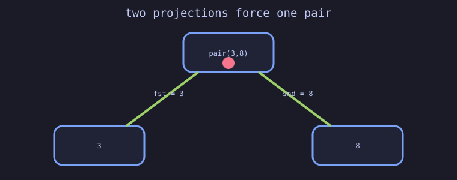

What to notice: satisfying both projections leaves only `pair(3,8)`; a
candidate such as `pair(3,9)` fails the second triangle. Sources:
[CLI lesson](demos/05-products/projections.mlpl), [web lesson](demos/web/products.mlpl).

### 6. Coproducts preserve which branch a value entered

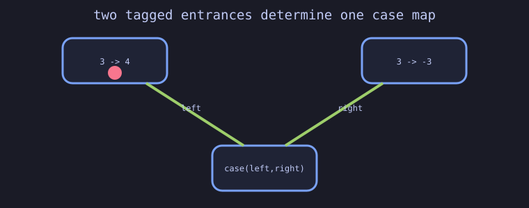

What to notice: the tag chooses `inc` for a left value and `negate` for a right
value. This is an executable value-level coproduct, not a claim that MLPL has
statically exhaustive sum types. Sources: [CLI lesson](demos/06-coproducts/case_analysis.mlpl),
[web lesson](demos/web/coproducts.mlpl).

### 7. Array mapping preserves identity and composition

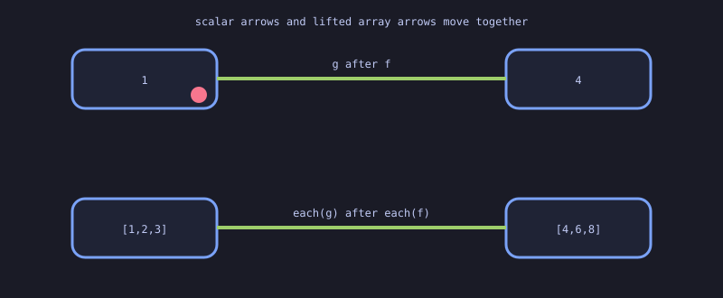

What to notice: applying `inc` then `double` cellwise gives the same array as
mapping their composition once. Mapping identity returns the original array.
Sources: [CLI lesson](demos/07-array-functors/map_laws.mlpl),
[web lesson](demos/web/array_functor.mlpl).

### 8. Preservation must name the structure

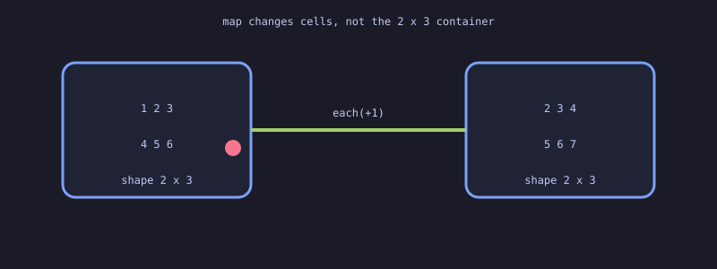

What to notice: every number changes while the `2×3` shape stays fixed.
Transpose illustrates a different preservation claim: it keeps entries but
changes the axes to `3×2`. Sources:
[CLI lesson](demos/08-shape-preservation/mapping_shape.mlpl),
[web lesson](demos/web/shape_preservation.mlpl).

### 9. Naturality is a family of commuting squares

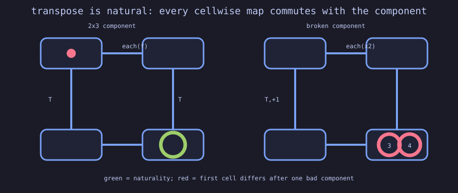

What to notice: transposing after a cellwise map equals mapping after
transpose, for each tested matrix shape. Adding `+1` inside one component
breaks compatibility immediately: flattened cell `0` becomes `3` versus `4`.
Sources: [CLI lesson](demos/09-natural-transformations/transpose.mlpl),
[web lesson](demos/web/natural_transformation.mlpl).

### 10. Homomorphisms form a category

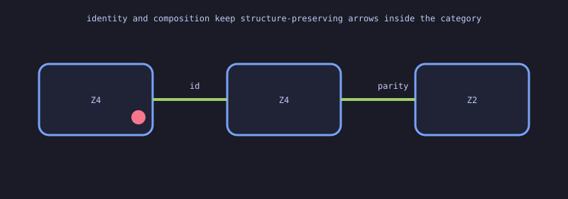

What to notice: identity preserves modular addition, parity preserves it, and
their composition is parity again. The preservation checker is copied and
attributed from the sibling algebra demo; this repository supplies the
categorical reading. Sources: [CLI lesson](demos/10-homomorphisms/compose.mlpl),
[web lesson](demos/web/homomorphisms.mlpl).

### 11. Associativity buys parallel execution

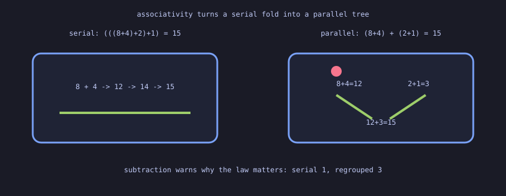

What to notice: `(8+4)` and `(2+1)` can run independently before combining,
because reassociation keeps the answer `15`. Subtraction reaches `1` serially
but `3` when regrouped, showing why the law is operationally necessary.
Sources: [CLI lesson](demos/11-lawful-reduction/regroup.mlpl),
[web lesson](demos/web/lawful_reduction.mlpl).

### 12. Mapping changes success, not failure

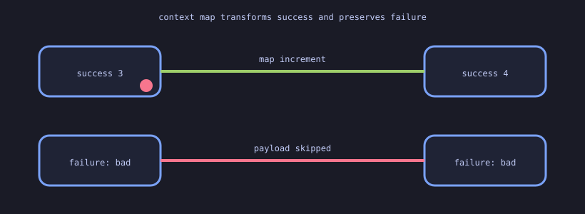

What to notice: the successful payload crosses `increment`, while the failed
context bypasses payload transformation and retains its diagnostic. Identity
and composition are checked for this concrete context. Sources:
[CLI lesson](demos/12-context-map/error_tracks.mlpl),
[web lesson](demos/web/context_map.mlpl).

### 13. Fallible stages compose with context-aware handoff

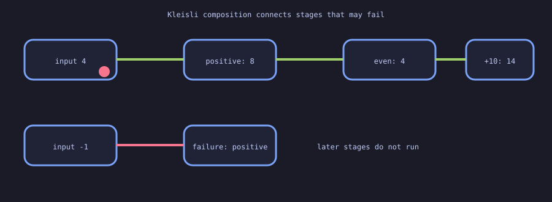

What to notice: input `4` reaches `14` through all stages; input `-1` becomes
`failure: not positive`, and later work is skipped. Left identity, right
identity, and associativity are executable tests rather than assumed jargon.
Sources: [CLI lesson](demos/13-kleisli-pipelines/fallible_stages.mlpl),
[web lesson](demos/web/kleisli_pipeline.mlpl).

### 14. Independent results converge after both succeed

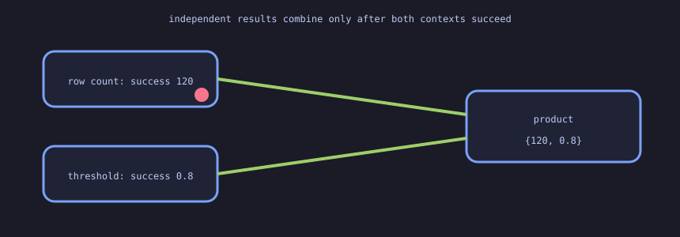

What to notice: row count `120` and threshold `0.8` travel on separate
branches. Neither result chooses the other; they form a product only after
both contexts succeed. Concrete identity and composition fixtures are checked.
Sources: [CLI lesson](demos/14-independent-contexts/combine_features.mlpl),
[web lesson](demos/web/independent_contexts.mlpl).

### 15. Dependent work consumes the earlier result

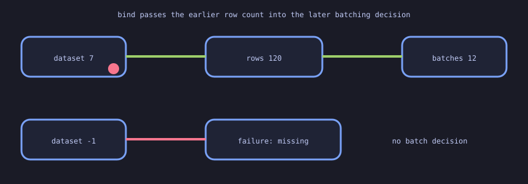

What to notice: the batching stage needs the loaded row count, so it cannot be
an independent branch. A missing dataset follows the red path and prevents any
batch decision. Sources:
[CLI lesson](demos/15-dependent-contexts/batch_after_load.mlpl),
[web lesson](demos/web/dependent_contexts.mlpl).

### 16. A lawful fold can fuse useful work

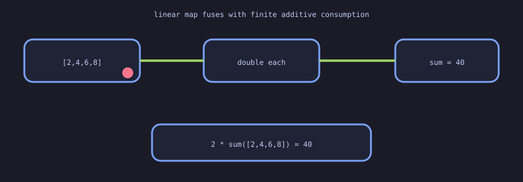

What to notice: doubling every metric and then summing produces the same `40`
as summing once and doubling the summary. Squaring supplies the counterexample:
`120` is not `400`. Sources: [CLI lesson](demos/16-folds/fuse_summary.mlpl),
[web lesson](demos/web/fold_fusion.mlpl).

### 17. An unfold generates a bounded schedule

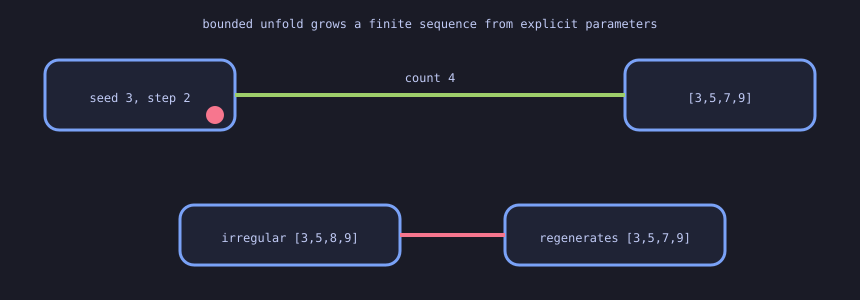

What to notice: seed `3`, step `2`, and count `4` deterministically generate
`[3,5,7,9]`. Recovering the first two parameters regenerates arithmetic
fixtures exactly, while `[3,5,8,9]` exposes the boundary. Sources:
[CLI lesson](demos/17-unfolds/bounded_generation.mlpl),
[web lesson](demos/web/bounded_unfold.mlpl).

### 18. A lawful lens changes one nested focus

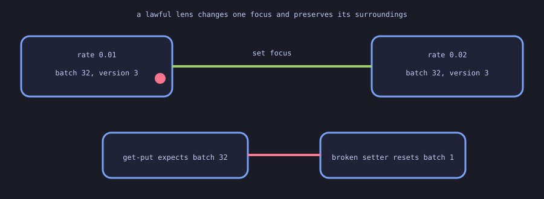

What to notice: the lawful path changes learning rate `0.01` to `0.02` while
batch size `32` and version `3` stay fixed. The red setter resets batch size to
`1`, visibly violating get-put. Sources:
[CLI lesson](demos/18-optics/model_learning_rate.mlpl),
[web lesson](demos/web/model_config_lens.mlpl).

### 19. Diagonal duplication is left adjoint to product

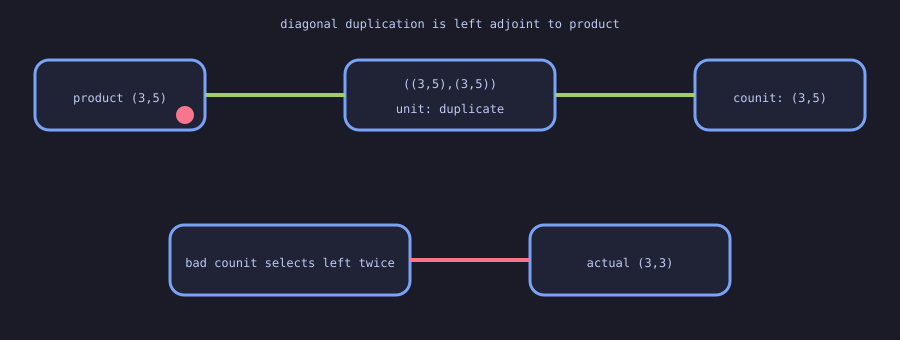

What to notice: duplicating `(3,5)` and then selecting the matching left/right
components returns `(3,5)` in both triangle identities. Selecting left twice
instead produces `(3,3)`. Sources:
[CLI lesson](demos/19-adjunction/duplicate_and_pair.mlpl),
[web lesson](demos/web/diagonal_product_adjunction.mlpl), and the
[adjunction decision](docs/adjunction-decision.md).

### 20. The opposite category reverses every arrow

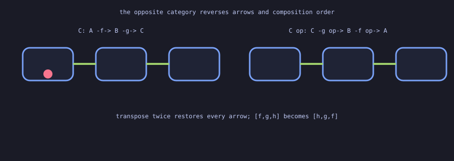

What to notice: transposing the finite arrow relation reverses every arrow,
and applying opposite twice restores the original. A path labelled `[f,g,h]`
must be read as `[h,g,f]` in the dual statement. Sources:
[CLI lesson](demos/20-duality/reverse_arrows.mlpl),
[web lesson](demos/web/opposite_duality.mlpl).

### 21. Universal endpoints are determined by unique arrows

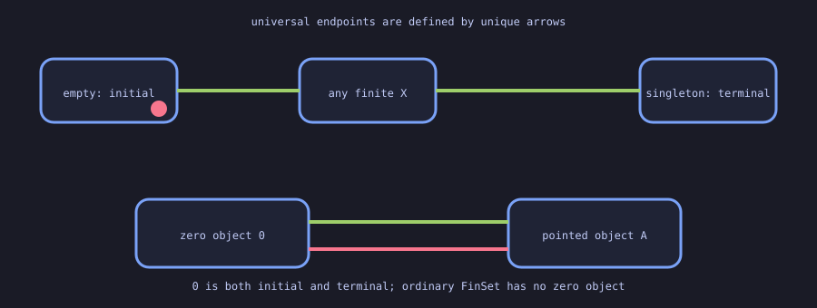

What to notice: empty sends exactly one function to each finite set, and
singleton receives exactly one. A pointed-category object with one arrow both
ways is zero; ordinary finite sets do not have a zero object. Sources:
[CLI lesson](demos/21-universal-endpoints/unique_arrows.mlpl),
[web lesson](demos/web/universal_endpoints.mlpl).

### 22. An equalizer keeps the largest agreeing subset

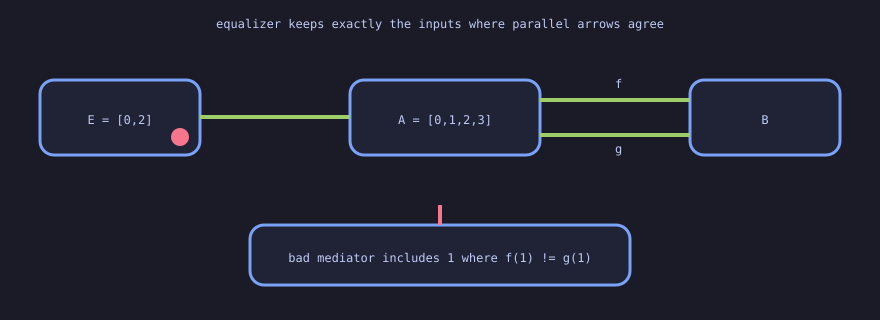

What to notice: classifiers `f` and `g` agree exactly on rows `0` and `2`.
Every mediator on which they agree must land in that subset and factors through
its inclusion. Sources: [CLI lesson](demos/22-equalizers/agreeing_rows.mlpl),
[web lesson](demos/web/equalizer.mlpl).

### 23. A coequalizer imposes the forced quotient

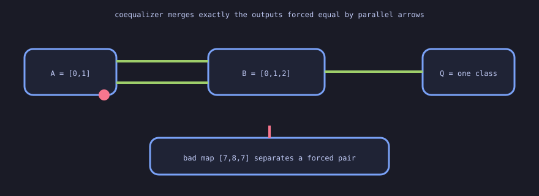

What to notice: the arrows force `0~1` and `1~2`, so all three labels merge.
The map `[7,8,7]` fails because it separates a forced-equal pair. Sources:
[CLI lesson](demos/23-coequalizers/forced_classes.mlpl),
[web lesson](demos/web/coequalizer.mlpl).

### 24. A pullback is a universal keyed join

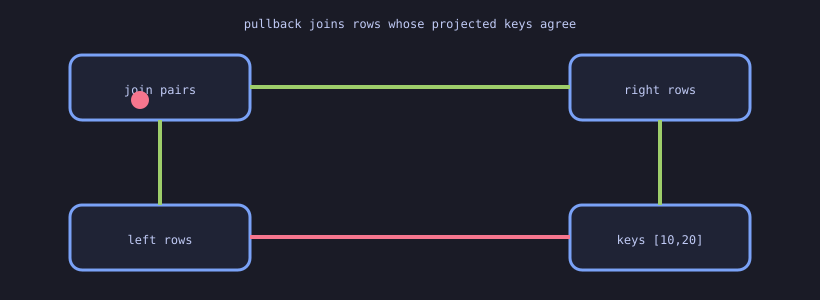

What to notice: left rows `[0,1]` pair with right rows `[1,0]`, so both
projections expose keys `[10,20]`. Sources:
[CLI lesson](demos/24-pullbacks/keyed_join.mlpl),
[web lesson](demos/web/pullback.mlpl).

### 25. A pushout is a universal tagged merge

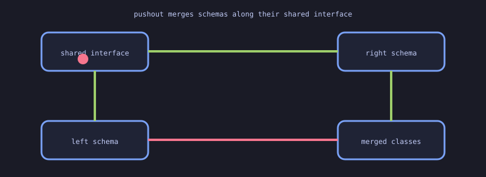

What to notice: two shared fields are identified while the left-private and
right-private fields remain distinct. Sources:
[CLI lesson](demos/25-pushouts/tagged_merge.mlpl),
[web lesson](demos/web/pushout.mlpl).

### 26. Finite limits and colimits are universal cones

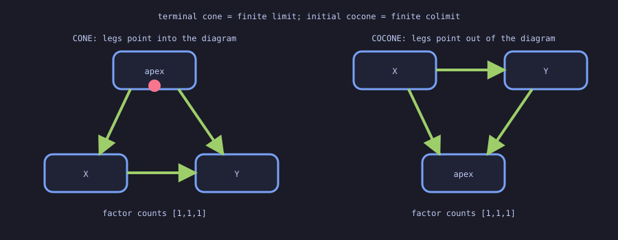

What to notice: arrowheads reverse between the cone and cocone. Factor counts
`[1,1,1]` select a terminal cone or initial cocone from bounded candidates;
`[1,2,1]` fails uniqueness. Products, equalizers, and pullbacks instantiate
finite-limit shapes, while coproducts, coequalizers, and pushouts are dual
finite-colimit shapes. Sources:
[CLI lesson](demos/26-finite-limits-colimits/universal_cones.mlpl),
[web lesson](demos/web/finite_limits_colimits.mlpl).

### 27. Representables turn composition into hom-set motion

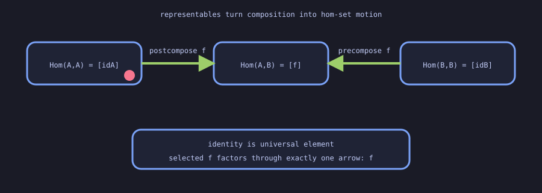

What to notice: postcomposition sends `idA` to `f`, while contravariant
precomposition sends `idB` to the same `f`. The representing identity element
recovers the selected arrow uniquely. Sources:
[CLI lesson](demos/27-representable-hom/hom_tables.mlpl),
[web lesson](demos/web/representable_hom.mlpl).

Generated working artifacts belong in gitignored `out/`; README-ready outputs
belong in `assets/previews/` and are rebuilt reproducibly.

## Repository boundary

This repository asks what survives when values are mapped between structures.
The adjacent `demo-abstract-algebra` repository asks what laws a single
operation obeys. Homomorphisms connect the two: algebra owns the preservation
checker, while this repository owns identity, composition, and the categorical
reading.

See [`AGENTS.md`](AGENTS.md) for the mandatory Agentrail workflow and demo
quality rules.

Terminology is defined in [`docs/terminology.md`](docs/terminology.md), the
sibling-repository contract in
[`docs/scope-boundary.md`](docs/scope-boundary.md), and the intentionally
deferred curriculum in
[`docs/advanced-saga-boundary.md`](docs/advanced-saga-boundary.md).
