# Visual Category Theory in sw-MLPL

Executable lessons where category-theory laws become diagrams you can inspect:
values move along arrows, both sides of an equation run over the same finite
inputs, and failed laws show a concrete counterexample.

The project is deliberately an sw-MLPL forcing function, not a proposal for a
category-theory DSL. It starts with functions, identity, and composition;
builds toward commutative diagrams, products, coproducts, array functors, and
natural transformations; then applies the same law-first method to contexts,
folds/unfolds, optics, and one concrete adjunction.

All thirty-two current lessons are implemented and checked. Start with the
[learning spine](docs/learning-spine.md) and
[viewing guide](docs/viewing-guide.md) for prerequisite-aware paths. The
[executable-leaf contract](docs/executable-leaf-contract.md) defines how every
current migration and future concept must teach, execute, visualize, and bound
its claim; the [lesson scorecard](docs/lesson-scorecard.md) separately judges
Category Theory teaching and how naturally sw-MLPL expresses it.

## Run it

```sh
just check   # probes, all CLI demos, tests, documentation and generated files
just demos   # terminal lessons and SVG output under out/
just web     # rebuild standalone browser lessons under web/
just assets  # rebuild the README previews
```

## Visual progression

The foundational curriculum makes these relationships visible:

```text
value ──f──▶ value                 one morphism

A ──f──▶ B                         two paths, one result
│         │
g         h
▼         ▼
C ──k──▶ D

scalar arrow                       lifted array arrow
A ──f──▶ B                         [A] ──map(f)──▶ [B]
```

The authoritative curriculum and delivery sequence are in
[`docs/plan.md`](docs/plan.md). Potential language capabilities—including the
different meanings of “full functor support”—are tracked in
[`docs/sw-mlpl-capabilities.md`](docs/sw-mlpl-capabilities.md).
The browser order is in [`web/START_HERE.md`](web/START_HERE.md), and the
checked teaching/expression audit for every visual leaf is in
[`docs/lesson-quality.tsv`](docs/lesson-quality.tsv).

## Demo visuals

### 1. Our first arrows are executable functions


What to notice: the colored token retains its identity while its value changes
from `3` to `6`. The diagram is backed by the displayed mapping of every input,
not a single cherry-picked value. This is the chosen concrete category of
finite number sets and functions; morphisms are not functions in every
category. Sources: [CLI lesson](demos/01-arrows/arrows.mlpl),
[web lesson](demos/web/arrows.mlpl).

### 2. Identity changes no destination


What to notice: the loop can be traversed before or after the meaningful arrow
without changing the endpoint. The three displayed arrays verify `id ; f = f =
f ; id`. Sources: [CLI lesson](demos/02-composition/identity.mlpl),
[web lesson](demos/web/identity_composition.mlpl).

### 3. Composition is associative


What to notice: both bracketings visit `A → B → C → D` in the same order and
finish together. Parentheses group the composition; they do not reroute it.
Sources: [CLI lesson](demos/03-associativity/bracketing.mlpl),
[web lesson](demos/web/composition_associativity.mlpl).

### 4. A commutative square is an equality you can run


What to notice: the lawful square sends input `0` to `2` along both routes.
Changing only the bottom arrow from `+2` to `+1` makes the first input land at
`2` versus `1`; the red split is the concrete counterexample returned by MLPL.
Sources: [CLI lesson](demos/04-commutative-squares/two_routes.mlpl),
[web lesson](demos/web/commutative_square.mlpl).

### 5. Products are fixed by their projections


What to notice: satisfying both projections leaves only `pair(3,8)`; a
candidate such as `pair(3,9)` fails the second triangle. Sources:
[CLI lesson](demos/05-products/projections.mlpl), [web lesson](demos/web/products.mlpl).

### 6. Coproducts preserve which branch a value entered


What to notice: the tag chooses `inc` for a left value and `negate` for a right
value. This is an executable value-level coproduct, not a claim that MLPL has
statically exhaustive sum types. Sources: [CLI lesson](demos/06-coproducts/case_analysis.mlpl),
[web lesson](demos/web/coproducts.mlpl).

### 7. Array mapping preserves identity and composition


What to notice: applying `inc` then `double` cellwise gives the same array as
mapping their composition once. Mapping identity returns the original array.
The functorial action is the array construction on value types together with
`each` on arrows—not arrays by themselves.
Sources: [CLI lesson](demos/07-array-functors/map_laws.mlpl),
[web lesson](demos/web/array_functor.mlpl).

### 8. Preservation must name the structure


What to notice: every number changes while the `2×3` shape stays fixed.
Transpose illustrates a different preservation claim: it keeps entries but
changes the axes to `3×2`. Sources:
[CLI lesson](demos/08-shape-preservation/mapping_shape.mlpl),
[web lesson](demos/web/shape_preservation.mlpl).

### 9. Naturality is a family of commuting squares


What to notice: transposing after a cellwise map equals mapping after
transpose, for each tested matrix shape. Adding `+1` inside one component
breaks compatibility immediately: flattened cell `0` becomes `3` versus `4`.
These computations verify finite naturality instances; they are not a general
proof for all shapes or categories.
Sources: [CLI lesson](demos/09-natural-transformations/transpose.mlpl),
[web lesson](demos/web/natural_transformation.mlpl).

### 10. Homomorphisms form a category


What to notice: identity preserves modular addition, parity preserves it, and
their composition is parity again. The preservation checker is copied and
attributed from the sibling algebra demo; this repository supplies the
categorical reading. Sources: [CLI lesson](demos/10-homomorphisms/compose.mlpl),
[web lesson](demos/web/homomorphisms.mlpl).

### 11. Associativity buys parallel execution


What to notice: `(8+4)` and `(2+1)` can run independently before combining,
because reassociation keeps the answer `15`. Subtraction reaches `1` serially
but `3` when regrouped, showing why the law is operationally necessary.
Sources: [CLI lesson](demos/11-lawful-reduction/regroup.mlpl),
[web lesson](demos/web/lawful_reduction.mlpl).

### 12. Mapping changes success, not failure


What to notice: the successful payload crosses `increment`, while the failed
context bypasses payload transformation and retains its diagnostic. Identity
and composition are checked for this concrete context. Sources:
[CLI lesson](demos/12-context-map/error_tracks.mlpl),
[web lesson](demos/web/context_map.mlpl).

### 13. Fallible stages compose with context-aware handoff


What to notice: input `4` reaches `14` through all stages; input `-1` becomes
`failure: not positive`, and later work is skipped. Left identity, right
identity, and associativity are executable tests rather than assumed jargon.
Sources: [CLI lesson](demos/13-kleisli-pipelines/fallible_stages.mlpl),
[web lesson](demos/web/kleisli_pipeline.mlpl).

### 14. Independent results converge after both succeed


What to notice: row count `120` and threshold `0.8` travel on separate
branches. Neither result chooses the other; they form a product only after
both contexts succeed. Concrete identity and composition fixtures are checked.
Sources: [CLI lesson](demos/14-independent-contexts/combine_features.mlpl),
[web lesson](demos/web/independent_contexts.mlpl).

### 15. Dependent work consumes the earlier result


What to notice: the batching stage needs the loaded row count, so it cannot be
an independent branch. A missing dataset follows the red path and prevents any
batch decision. Sources:
[CLI lesson](demos/15-dependent-contexts/batch_after_load.mlpl),
[web lesson](demos/web/dependent_contexts.mlpl).

### 16. A lawful fold can fuse useful work


What to notice: doubling every metric and then summing produces the same `40`
as summing once and doubling the summary. Squaring supplies the counterexample:
`120` is not `400`. Sources: [CLI lesson](demos/16-folds/fuse_summary.mlpl),
[web lesson](demos/web/fold_fusion.mlpl).

### 17. An unfold generates a bounded schedule


What to notice: seed `3`, step `2`, and count `4` deterministically generate
`[3,5,7,9]`. Recovering the first two parameters regenerates arithmetic
fixtures exactly, while `[3,5,8,9]` exposes the boundary. Sources:
[CLI lesson](demos/17-unfolds/bounded_generation.mlpl),
[web lesson](demos/web/bounded_unfold.mlpl).

### 18. A lawful lens changes one nested focus


What to notice: the lawful path changes learning rate `0.01` to `0.02` while
batch size `32` and version `3` stay fixed. The red setter resets batch size to
`1`, visibly violating get-put. Sources:
[CLI lesson](demos/18-optics/model_learning_rate.mlpl),
[web lesson](demos/web/model_config_lens.mlpl).

### 19. Diagonal duplication is left adjoint to product


What to notice: duplicating `(3,5)` and then selecting the matching left/right
components returns `(3,5)` in both triangle identities. Selecting left twice
instead produces `(3,3)`. Read this after products and functors: duplication
and product come first, then unit/counit, then the triangle checks. Sources:
[CLI lesson](demos/19-adjunction/duplicate_and_pair.mlpl),
[web lesson](demos/web/diagonal_product_adjunction.mlpl), and the
[adjunction decision](docs/adjunction-decision.md).

### 20. The opposite category reverses every arrow


What to notice: transposing the finite arrow relation reverses every arrow,
and applying opposite twice restores the original. A path labelled `[f,g,h]`
must be read as `[h,g,f]` in the dual statement. Sources:
[CLI lesson](demos/20-duality/reverse_arrows.mlpl),
[web lesson](demos/web/opposite_duality.mlpl).

### 21. Universal endpoints are determined by unique arrows


What to notice: empty sends exactly one function to each finite set, and
singleton receives exactly one. A pointed-category object with one arrow both
ways is zero; ordinary finite sets do not have a zero object. Sources:
[CLI lesson](demos/21-universal-endpoints/unique_arrows.mlpl),
[web lesson](demos/web/universal_endpoints.mlpl).

### 22. An equalizer universally includes the agreeing inputs


What to notice: classifiers `f` and `g` agree exactly on rows `0` and `2`.
In finite sets this looks like an agreeing subset, but the categorical content
is that every equalizing mediator factors uniquely through its inclusion.
Sources: [CLI lesson](demos/22-equalizers/agreeing_rows.mlpl),
[web lesson](demos/web/equalizer.mlpl).

### 23. A coequalizer imposes the forced quotient


What to notice: the arrows force `0~1` and `1~2`, so all three labels merge.
The map `[7,8,7]` fails because it separates a forced-equal pair. Sources:
[CLI lesson](demos/23-coequalizers/forced_classes.mlpl),
[web lesson](demos/web/coequalizer.mlpl).

### 24. A pullback is a universal keyed join


What to notice: left rows `[0,1]` pair with right rows `[1,0]`, so both
projections expose keys `[10,20]`. Sources:
[CLI lesson](demos/24-pullbacks/keyed_join.mlpl),
[web lesson](demos/web/pullback.mlpl).

### 25. A pushout is a universal tagged merge


What to notice: two shared fields are identified while the left-private and
right-private fields remain distinct. Sources:
[CLI lesson](demos/25-pushouts/tagged_merge.mlpl),
[web lesson](demos/web/pushout.mlpl).

### 26. Finite limits and colimits are universal cones


What to notice: arrowheads reverse between the cone and cocone. Factor counts
`[1,1,1]` select a terminal cone or initial cocone from bounded candidates;
`[1,2,1]` fails uniqueness. Products, equalizers, and pullbacks instantiate
finite-limit shapes, while coproducts, coequalizers, and pushouts are dual
finite-colimit shapes. Sources:
[CLI lesson](demos/26-finite-limits-colimits/universal_cones.mlpl),
[web lesson](demos/web/finite_limits_colimits.mlpl).

### 27. Representables turn composition into hom-set motion


What to notice: postcomposition sends `idA` to `f`, while contravariant
precomposition sends `idB` to the same `f`. The representing identity element
recovers the selected arrow uniquely. Sources:
[CLI lesson](demos/27-representable-hom/hom_tables.mlpl),
[web lesson](demos/web/representable_hom.mlpl).

### 28. Yoneda turns transformations into elements

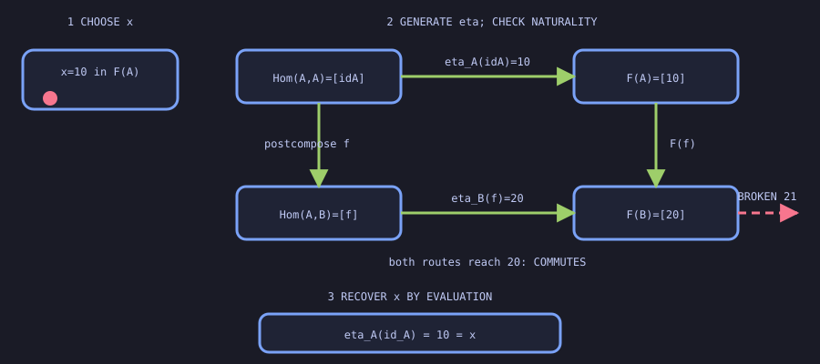

What to notice: read the numbered stages. Choose `x=10` in `F(A)`. It generates
`eta_A(idA)=10` and `eta_B(f)=20`; the displayed square says both routes reach
`20`. Finally, evaluating `eta_A` at `idA` recovers the original `10`. The
dashed `21` shows exactly how naturality can fail. Category-of-elements and
density intuition remain an optional CLI/test extension, outside this visual.
Sources:
[CLI lesson](demos/28-yoneda-elements/correspondence.mlpl),
[web lesson](demos/web/finite_yoneda.mlpl).

### 29. Universal objects are uniquely isomorphic

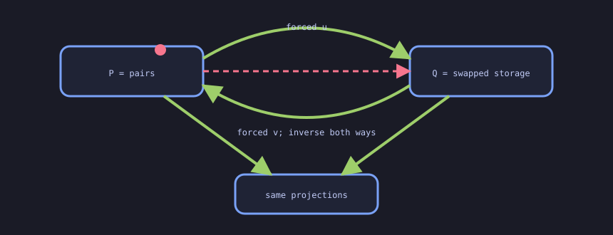

What to notice: `P` and `Q` store the same binary product differently.
Preserving both projections forces the green comparison map `[0,2,1,3]` in
each direction, and both round trips are identities. The dashed red identity
index map fails a projection, so it is not a competing universal comparison.
Sources:
[CLI lesson](demos/29-unique-universal-isomorphism/forced_inverse.mlpl),
[web lesson](demos/web/unique_universal_isomorphism.mlpl).

### 30. Diagonal functors build constant diagrams

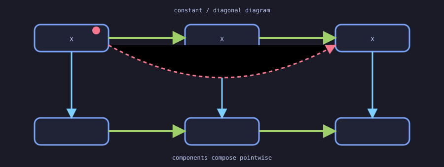

What to notice: the composable-pair shape receives the same object `X` and
identity arrow at every node and edge. Blue components connect two diagram
objects and compose pointwise. A changed composite arrow breaks the functor
law. Sources: [CLI lesson](demos/30-diagram-functors/constant_diagonal.mlpl),
[web lesson](demos/web/diagram_constant_diagonal.mlpl).

### 31. Three objects form a bounded indexed limit and colimit

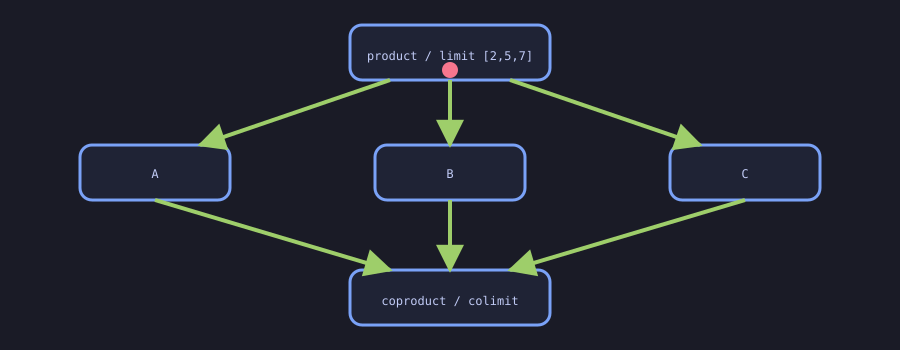

What to notice: `[2,5,7]` is forced by three projections; the tagged coproduct
case map is forced by three injections. This finite discrete index has a limit
and colimit, but the demonstrated width is three—not arbitrary or infinite.
Sources: [CLI lesson](demos/31-bounded-indexed-products/three_object_family.mlpl),
[web lesson](demos/web/bounded_indexed_products.mlpl).

### 32. Compatibility turns legs into universal cones

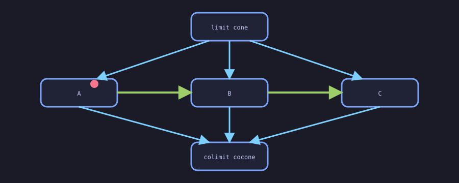

What to notice: unlike the discrete diagram, `A → B → C` imposes two
compatibility equations. Blue legs form a cone or cocone only when both
commute; mediator counts `[1,1,1]` then establish bounded universality. Sources:
[CLI lesson](demos/32-generalized-cones/chain_cones.mlpl),
[web lesson](demos/web/generalized_bounded_cones.mlpl).

### 33. Functors preserve, reflect, or create universality differently

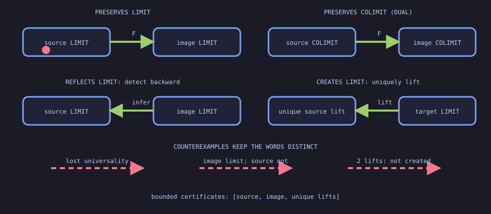

What to notice: preservation sends a known universal cone forward. Reflection
uses an image limit to detect that the source cone was already universal.
Creation additionally requires exactly one universal source lift of the target
limit. The three dashed failures—lost universality, a nonuniversal source, and
two competing lifts—keep the terms distinct. All certificates are bounded
finite fixtures. Sources:
[CLI lesson](demos/33-preservation-creation-reflection/before_after.mlpl),
[web lesson](demos/web/preservation_creation_reflection.mlpl).

### 34. Filtered and directed systems reveal direction—and a boundary

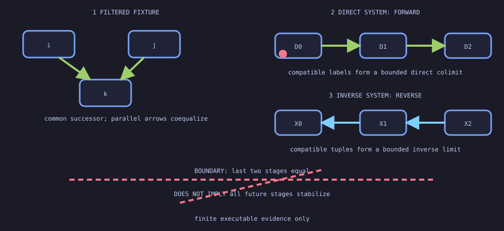

What to notice: the finite filtered fixture gives every displayed pair a
common successor and coequalizes its displayed parallel arrows. A directed
preorder is the corresponding order-shaped special case. Green arrows carry
compatible labels forward for direct systems; blue arrows restrict compatible
tuples backward for inverse systems. Even when the last two stages match, the
dashed warning forbids concluding that every future stage stabilizes. Sources:
[CLI lesson](demos/34-filtered-directed-systems/finite_prefix.mlpl),
[web lesson](demos/web/filtered_directed_systems.mlpl).

### 35. Comma direction distinguishes final from initial functors

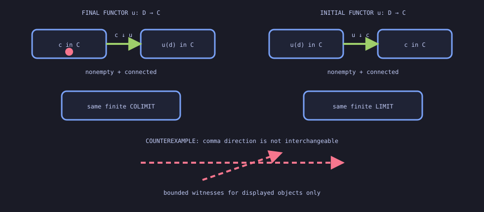

What to notice: finality asks whether each displayed `c ↓ u` is nonempty and
connected, then compares the finite colimit after restriction. Initiality uses
the opposite `u ↓ c` orientation and compares the finite limit. The crossed
dashed arrow warns that these comma directions are not interchangeable. This
is bounded evidence, not a proof of the general cofinality theorems. Sources:
[CLI lesson](demos/35-final-initial-functors/comma_witnesses.mlpl),
[web lesson](demos/web/final_initial_functors.mlpl).

### 36. An exponential object stores functions as elements

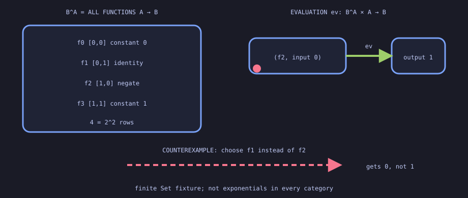

What to notice: `B^A` contains all four function rows from `{0,1}` to
`{0,1}`—not merely a few examples. Evaluation takes a chosen row together with
an input and returns the selected table entry. The dashed counterexample picks
identity instead of negation and reaches `0` rather than `1`. This verifies one
finite exponential object, not cartesian closure of an arbitrary category.
Sources: [CLI lesson](demos/36-finite-exponentials/evaluate_rows.mlpl),
[web lesson](demos/web/finite_exponentials.mlpl).

### 37. Currying changes function shape without changing behavior

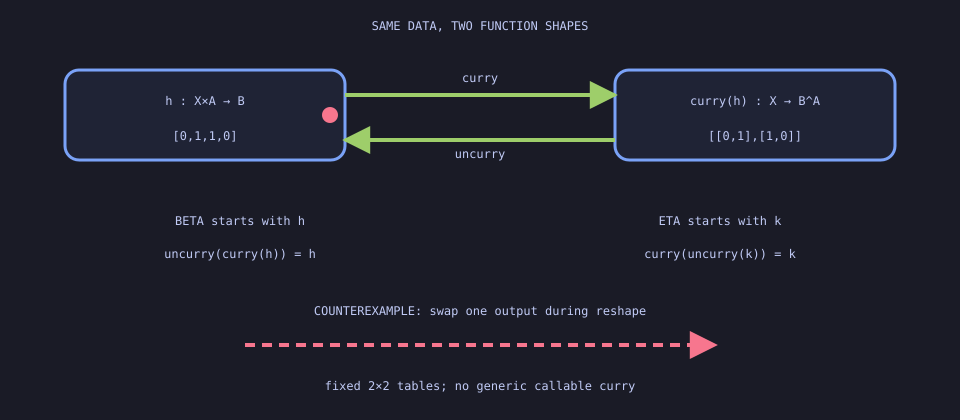

What to notice: curry changes `[0,1,1,0]` on `X×A` into rows
`[[0,1],[1,0]]` indexed by `X`; uncurry reverses that grouping. Beta starts at
the flat map, while eta starts at the row-shaped map. A changed entry breaks
the correspondence. This is explicit 2×2 table reshaping, not generic callable
currying. Sources: [CLI lesson](demos/37-finite-currying/round_trips.mlpl),
[web lesson](demos/web/finite_currying.mlpl).

### 38. One internal hom does not make a cartesian closed category

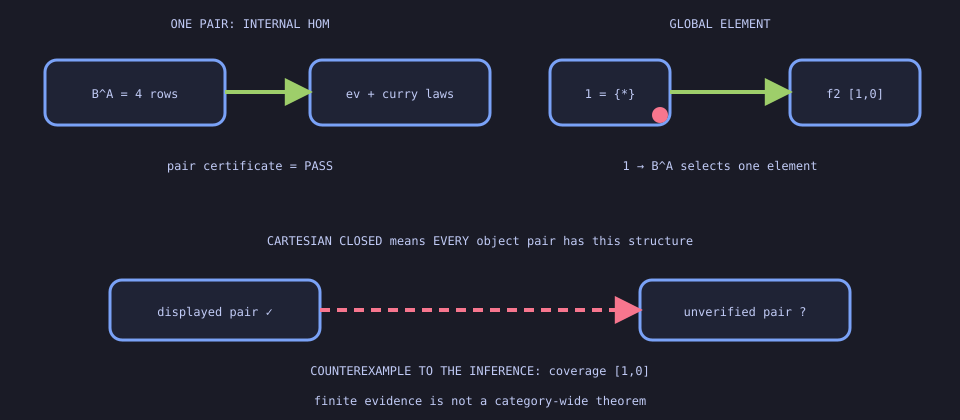

What to notice: the displayed pair has product/exponential evidence, and a map
from singleton selects negation as a global element of the internal hom. But
cartesian closure quantifies over every object pair. The dashed missing pair
makes that unproved coverage visible rather than silently generalizing it.
Sources: [CLI lesson](demos/38-cartesian-closed-boundary/pair_evidence.mlpl),
[web lesson](demos/web/cartesian_closed_boundary.mlpl).

### 39. Truth maps classify finite subobjects

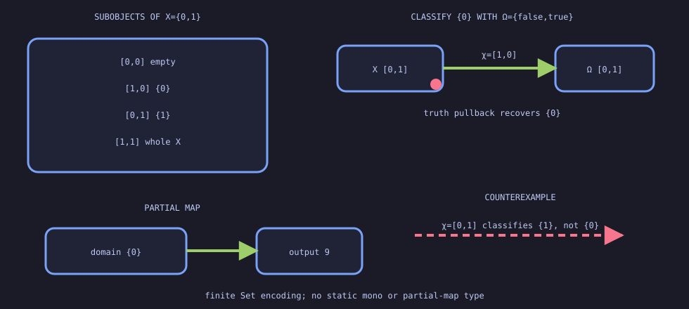

What to notice: the four Boolean rows inventory every subset of `{0,1}`. The
map `χ=[1,0]` sends exactly `{0}` to true, so pulling back truth recovers that
subobject; `[0,1]` classifies the wrong subset. The partial map stores output
`9` only on its explicit domain `{0}`. Sources:
[CLI lesson](demos/39-finite-subobjects/classify_domain.mlpl),
[web lesson](demos/web/finite_subobjects.mlpl).

### 40. Slice and coslice categories fix opposite arrow endpoints

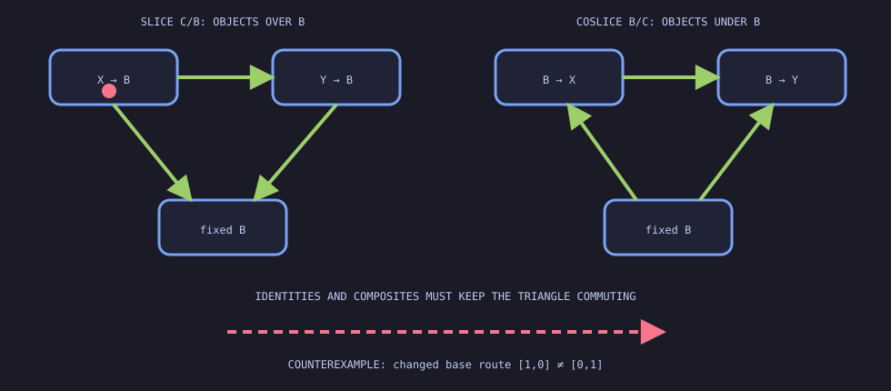

What to notice: every slice object carries a map to `B`; every coslice object
carries a map from `B`. The top morphism belongs to the new category only when
its triangle commutes. Identity and composition preserve the triangle, while a
changed base route fails. Sources:
[CLI lesson](demos/40-slices-coslices/commuting_triangles.mlpl),
[web lesson](demos/web/finite_slices_coslices.mlpl).

### 41. Dependent sums gather; dependent products choose

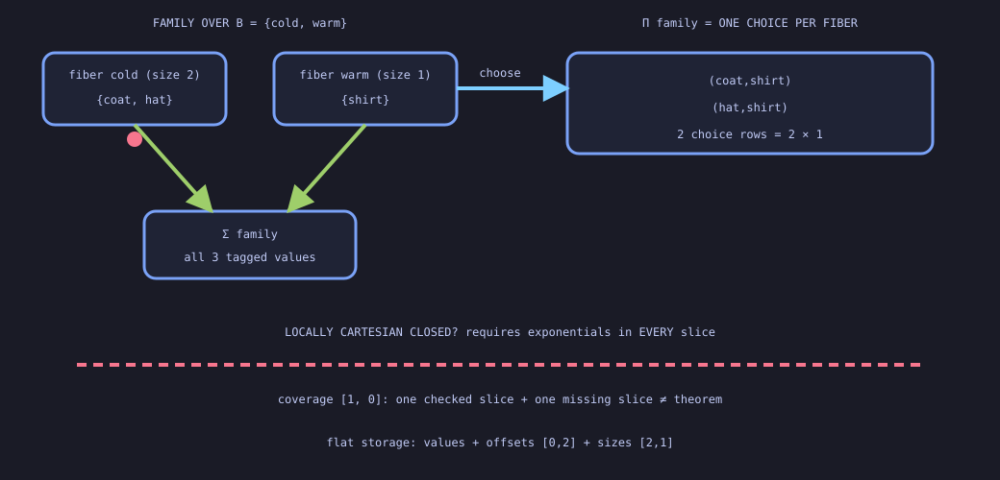

What to notice: the family is stored as flat values plus offsets and sizes.
Its dependent sum contains every value tagged by its source fiber; its
dependent product contains every row choosing one value from each fiber. The
dashed coverage line shows why one successful family does not establish
exponentials in every slice, so local cartesian closure remains constrained.
Sources: [CLI lesson](demos/41-dependent-constructions/fiber_tables.mlpl),
[web lesson](demos/web/finite_dependent_constructions.mlpl).

### 42. A polynomial container separates shapes from positions

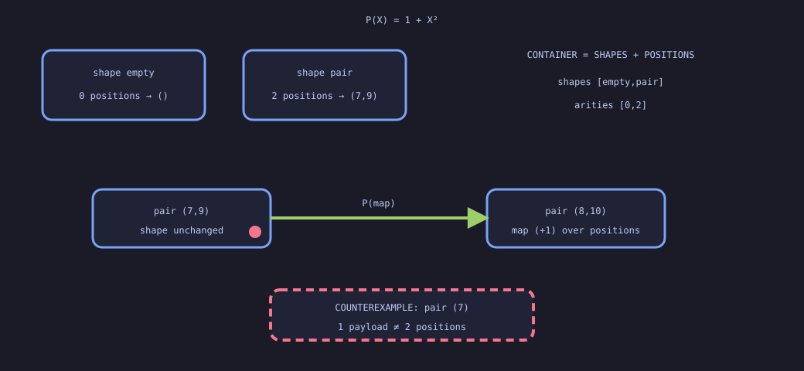

What to notice: `P(X)=1+X²` has an empty shape with zero positions and a pair
shape with two. Mapping changes `(7,9)` to `(8,10)` without changing the pair
shape. The dashed one-payload pair fails because its selected shape demands two
positions. Sources:
[CLI lesson](demos/42-polynomial-containers/optional_pair.mlpl),
[web lesson](demos/web/finite_polynomial_containers.mlpl).

### 43. Monoidal coherence compares different rebracketing paths

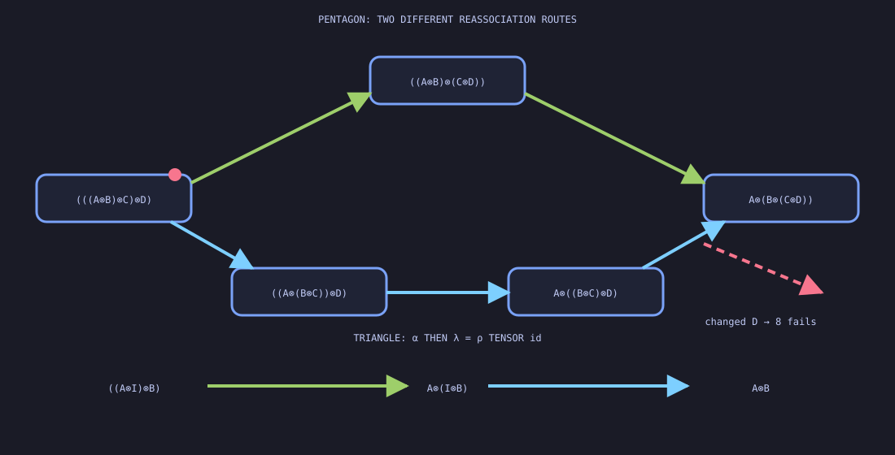

What to notice: green uses two associators across the pentagon; blue uses
three around it. Their intermediate tensor nestings differ, but both end at
`A⊗(B⊗(C⊗D))`. The triangle separately compares associator-then-left-unitor
with right-unitor tensor identity. Changing the final payload breaks equality.
Sources: [CLI lesson](demos/43-monoidal-foundation/coherence_paths.mlpl),
[web lesson](demos/web/finite_monoidal_foundation.mlpl).

### 44. Coherent isomorphism is not literal strictness

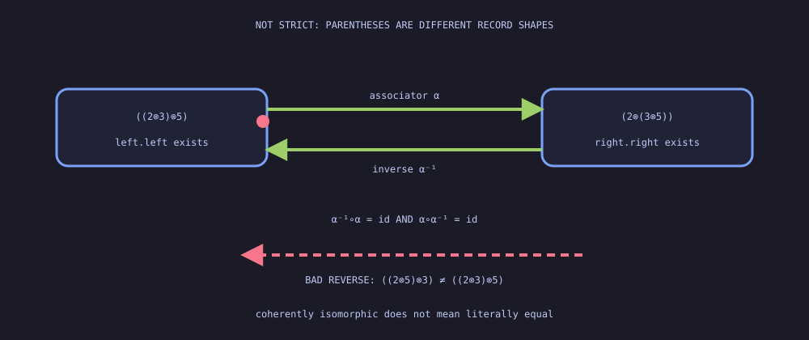

What to notice: the two boxes retain different nested-record shapes, so they
are not equal. The green associator arrows preserve payload order and compose
to identities in both directions. The dashed reverse swaps two payloads and is
not an inverse. Sources:
[CLI lesson](demos/44-monoidal-strictness/parentheses.mlpl),
[web lesson](demos/web/finite_monoidal_strictness.mlpl).

### 45. Braiding a block agrees with crossing its components

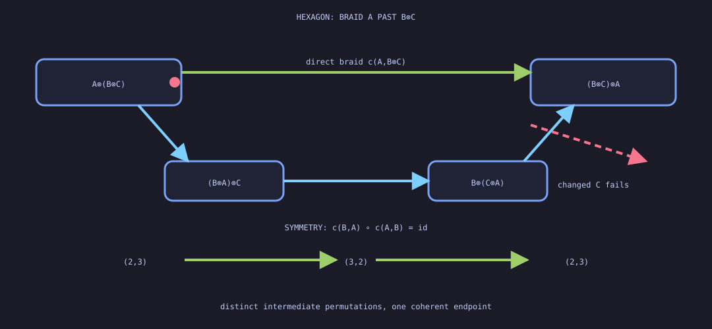

What to notice: green moves `A` past `B⊗C` in one crossing; blue crosses `A`
past `B` and `C` separately through different intermediate nestings. Both
reach `(B⊗C)⊗A`. Below, swapping `(2,3)` twice restores it. Sources:
[CLI lesson](demos/45-braided-symmetric/hexagon.mlpl),
[web lesson](demos/web/finite_braided_symmetric.mlpl).

### 46. Monoid objects merge; comonoid objects split

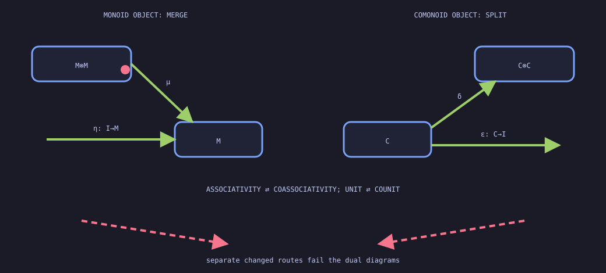

What to notice: multiplication and unit point into the monoid object;
comultiplication and counit reverse the construction. Each side has its own
commuting laws and broken route. Sources:
[CLI lesson](demos/46-monoid-comonoid/internal_diagrams.mlpl),
[web lesson](demos/web/finite_monoid_comonoid.mlpl).

### 47. Package known group data; expose missing module evidence

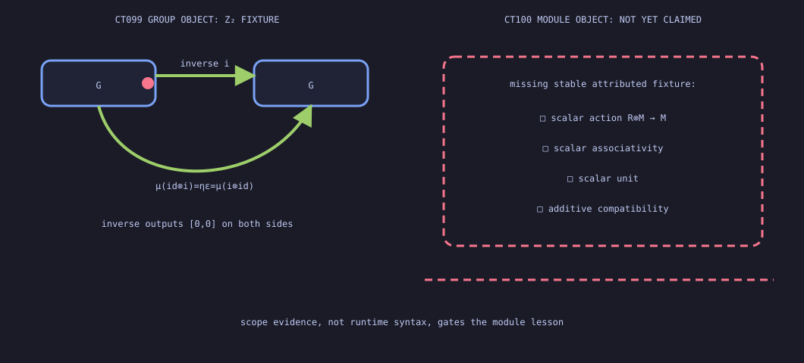

What to notice: both Z2 inverse routes reach unit `0`; changing one route
fails. The module panel is deliberately incomplete because no stable
scalar-action fixture exists locally. Sources:
[CLI lesson](demos/47-group-module-boundary/inverse_and_missing_action.mlpl),
[web lesson](demos/web/finite_group_module_boundary.mlpl).

### 48. Follow the monoidal comparison arrows

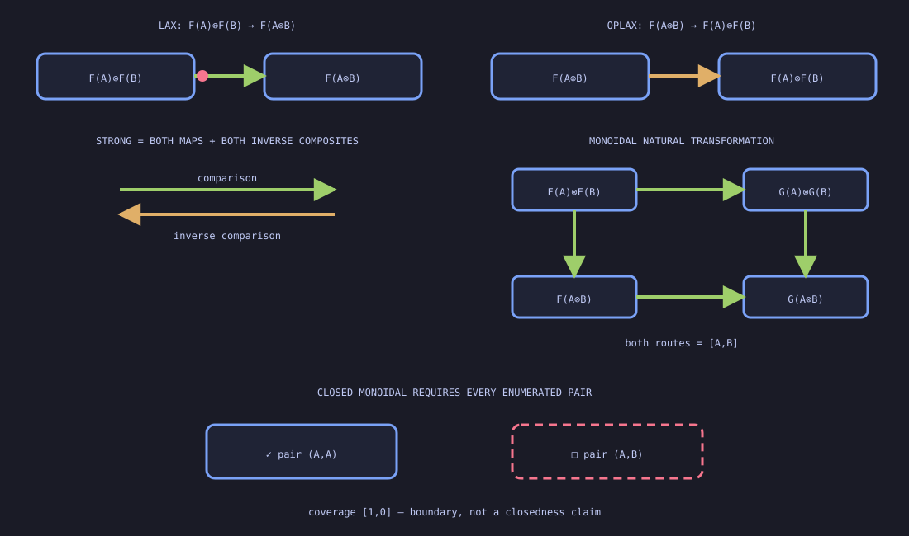

What to notice: lax points from `F(A) tensor F(B)` into `F(A tensor B)`;
oplax points the other way. Strong structure needs both inverse composites,
and the dashed object pair prevents a closed-monoidal claim. Sources:
[CLI lesson](demos/48-monoidal-functors/comparison_maps.mlpl),
[web lesson](demos/web/finite_monoidal_functors.mlpl).

### 49. Verify both dual snakes; audit compact coverage

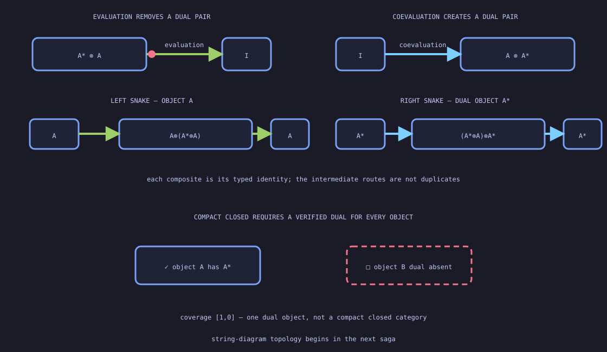

What to notice: evaluation removes a dual pair and coevaluation creates one.
The green route returns `A`, the blue route returns `A*`, and each is checked
against its own identity. The dashed object blocks the stronger compact-closed
claim. Sources:
[CLI lesson](demos/49-dual-compact-boundary/snake_routes.mlpl),
[web lesson](demos/web/finite_dual_compact_boundary.mlpl).

### 50. Check semantic wires before moving the drawing

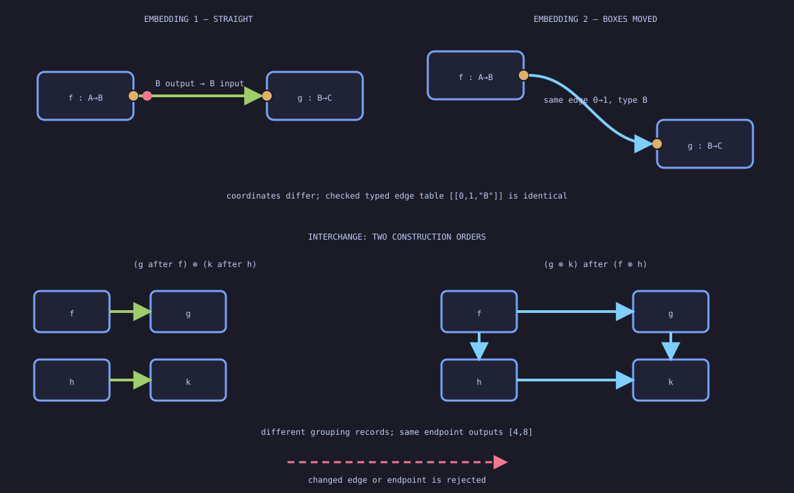

What to notice: the upper boxes move and the wire bends, but both drawings
retain semantic edge `0 → 1 : B`. Below, sequential-then-tensor and
tensor-then-sequential use different grouping records and reach `[4,8]`.
Sources: [CLI lesson](demos/50-semantic-string-graphs/typed_interchange.mlpl),
[web lesson](demos/web/finite_string_graphs.mlpl).

Generated working artifacts belong in gitignored `out/`; README-ready outputs
belong in `assets/previews/` and are rebuilt reproducibly.

## Repository boundary

This repository asks what survives when values are mapped between structures.
The adjacent `demo-abstract-algebra` repository asks what laws a single
operation obeys. Homomorphisms connect the two: algebra owns the preservation
checker, while this repository owns identity, composition, and the categorical
reading.

See [`AGENTS.md`](AGENTS.md) for the mandatory Agentrail workflow and demo
quality rules.

Terminology is defined in [`docs/terminology.md`](docs/terminology.md), the
sibling-repository contract in
[`docs/scope-boundary.md`](docs/scope-boundary.md), and the intentionally
deferred curriculum in
[`docs/advanced-saga-boundary.md`](docs/advanced-saga-boundary.md).
